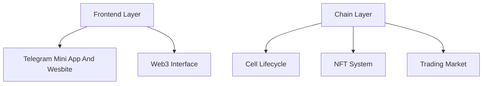

# LifeChain Genesis 🧬

> *"When life reaches its end and we look back, those seemingly random trajectories weave together into a brilliant pattern.*
> 
> *Here, the life and death of each cell is a stroke in an eternal canvas."*

Explore an infinite blockchain-powered life evolution metaverse, where you can create and nurture your unique life forms. Every cell's birth, reproduction, and death leaves an eternal imprint on the chain, forming unique life trajectories.

## 🌟 Overview
LifeChain Genesis is a revolutionary GameFi project that perfectly merges Conway's Game of Life with Web3 technology. On this digital life canvas, each cell writes its own story. Through a unique NFT cell system and innovative evolution mechanisms, players can create, reproduce, and evolve their digital life in an infinitely expanding grid world, with every life's complete journey permanently preserved on-chain.

## ✨ Core Features
🧬 **NFT Cell System**: Each cell is a unique NFT, carrying its own life trajectory  
🎮 **Innovative Gameplay**: Combines Conway's Game of Life rules with Web3 economic systems  
🌍 **Infinite Canvas**: Weave life patterns in an expanding grid space  
💰 **Economic System**: Sustainable Play-to-Earn mechanism with diverse revenue models  
🤝 **Community Driven**: DAO governance and community building  
🔄 **Life Trajectories**: Record and replay complete life journeys on-chain  

## 💫 NFT Ecosystem

### 🧬 Cell Characteristics
- Unique DNA sequences, like life's fingerprints
- Inheritable attribute system, passing down life traits
- Mutation and evolution mechanisms, creating endless possibilities
- Gene recombination features, weaving new life patterns

### 🎮 Game Modes
- **Exploration Mode**: Discover life's mysteries on infinite canvas
- **Competition Mode**: Let different life patterns collide
- **Creation Mode**: Design exclusive life artworks
- **Retrospect Mode**: Watch complete evolution journey of each life form

### 🎨 Life Trajectories
- **Time Dimension**: Record each cell's life journey
- **Space Dimension**: Capture moments of colony evolution
- **Interaction Dimension**: Preserve traces of cell interactions
- **Art Dimension**: Transform life trajectories into visual art

## 🚀 Quick Start
1. Connect Web3 wallet
2. Purchase initial cells
3. Design cell layout
4. Start life evolution

## 🛠 Technical Implementation

### Tech Stack
- **Frontend**: Unity 3D, React, TypeScript
- **Blockchain**: Ethereum, Solidity
- **Storage**: IPFS, Graph Protocol
- **AI Integration**: 
  - Cell attribute generation
  - Evolution path prediction
  - Ecosystem analysis

## 📈 Roadmap

| Phase | Timeline | Goals |
|------|------|------|
| Launch | Q2 2024 | Basic system development, NFT deployment |
| Growth | Q3 2024 | Feature expansion, community building |
| Prosperity | Q4 2024 | Ecosystem completion, global operations |

## 📸 Platform Preview
| Grid World | Cell Market | 
|----------|----------|

2. **Space Rental**
   - Earn income by renting grid space
   - Provide cell cultivation services

3. **Competition Rewards**
   - Participate in periodic evolution competitions
   - Rewards for creating most stable ecosystems

## 🔮 Special Features

### Life Retrospection
- Complete recording of cell life trajectories
- Visualization of every moment in evolution
- Generation of unique life trajectory artworks
- Share and collect amazing life stories

### Artistic Creation
- Transform life trajectories into artworks
- Unique visual effect rendering system
- Support NFT minting of artworks
- Host life art exhibitions

### Social Interaction
- Cell mating system
- Alliance building mechanism
- Cross-grid collaboration

### Research Value
- Provide evolution pattern research data
- Support algorithm optimization experiments
- Open API interface

## 🛠 Technical Implementation

### Smart Contracts
- Cell lifecycle management
- Attribute system implementation
- Trading market contracts

### On-chain Storage
- Cell state recording
- Evolution history storage
- Attribute data management

### Frontend Interface
- Grid world rendering
- Real-time evolution display
- Interactive operation interface

## Deployment 

GameOfLife contract deployed to: 0x4Ae98b16E13EA366ee53F76FBbE5A8F9eEC9DEF5
SmartContract: 0x4Ae98b16E13EA366ee53F76FBbE5A8F9eEC9DEF5

View on Mantle Explorer:
https://sepolia.mantlescan.xyz/address/0x4Ae98b16E13EA366ee53F76FBbE5A8F9eEC9DEF5

## 🤔 FAQ

Q: What is LifeChain Genesis?  
A: LifeChain Genesis is a Web3 game based on Conway's Game of Life rules, where players can create and nurture unique NFT cell life forms.

Q: How to start playing LifeChain Genesis?  
A: Connect your Web3 wallet, purchase initial cells, design your cell layout, and begin your life evolution journey.

Q: How to earn revenue?  
A: Earn through cell reproduction, rare trait cultivation, space rental, competition rewards, and various other methods.

## 📜 License

  
MIT © 2024 LifeChain Genesis Team

*Let's paint life's poetry together on this infinite canvas*

